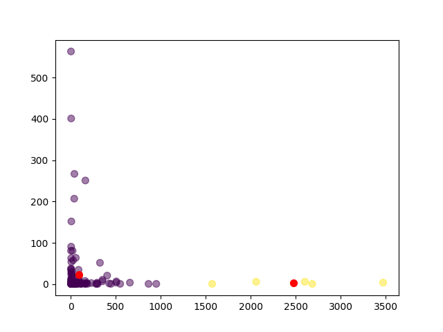

---
author:
- Dr. Kamakshaiah Musunuru
title: "`litreviewer`: A Python Package for Review of Literature (RoL)"
---

# Background

## Secondary research

Secondary research involves the summary, collation and/or synthesis of
existing research. Secondary research is contrasted with primary
research in that primary research involves the generation of data,
whereas secondary research uses primary research sources as a source of
data for analysis. A notable marker of primary research is the inclusion
of a "methods" section, where the authors describe how the data was
generated. Common examples of secondary research include *textbooks,
encyclopedias, news articles, review articles,* and *meta analysis.*
[@Ormsby] [@Andrews] When conducting secondary research, authors may
draw data from published academic papers, government documents,
statistical databases, and historical records.

## Literature review

A Literature Review is a systematic and comprehensive analysis of books,
scholarly articles, and other sources relevant to a specific topic
providing a base of knowledge on a topic. A literature review is an
overview of the previously published works on a specific topic.
Literature reviews are designed to identify and critique the existing
literature on a topic to justify your research by exposing gaps in
current research. This investigation should provide a description,
summary, and critical evaluation of works related to the research
problem and should also add to the overall knowledge of the topic as
well as demonstrating how your research will fit within a larger field
of study. A literature review should offer a critical analysis of the
current research on a topic and that analysis should direct your
research objective. This should not be confused with a book review or an
annotated bibliography both research tools but very different in purpose
and scope. A Literature Review can be a stand-alone element or part of a
larger end product, know your assignment. The key to a good Literature
Review is to document your process.

Mostly this phrase may refer to a full scholarly paper or a section of a
scholarly work such as a book, or an article. Either way, a literature
review is supposed to provide the researcher/author and the audiences
with a general image of the existing knowledge on the topic under
question. A good literature review can ensure that a proper research
question has been asked and a proper theoretical framework and/or
research methodology have been chosen. In other words, a literature
review serves to situate the current study within the body of the
relevant literature and to provide context for the reader. Literature
review is often a part of scholarly work, including in the preparation
of a thesis, dissertation, or a journal article. Literature reviews are
also common in a research proposal or prospectus. [@Baglione]

Literature reviews are secondary sources and do not report new or
original experimental work. Most often associated with academic-oriented
literature, such reviews are found in academic journals and are not to
be confused with book reviews, which may also appear in the same
publication. Literature reviews are a basis for research in nearly every
academic field.

## Types

The main types of literature reviews are: *evaluative, exploratory,
instrumental, systematic review* and . [@Adams]

### Systematic review

Systematic reviews are a type of review that uses repeatable analytical
methods to collect secondary data and analyze it. Systematic reviews are
a type of evidence synthesis which formulate research questions that are
broad or narrow in scope, and identify and synthesize data that directly
relate to the systematic review question. Systematic reviews critically
appraise research studies, and synthesize findings qualitatively or
quantitatively.[@Armstrong] Systematic reviews are often designed to
provide an exhaustive summary of current evidence relevant to a research
question.

The process of creating a systematic review can be broken down into
between four and 15 tasks depending on resolution. [@Cochrane]
Systematic reviews are conducted through a robust but slow and
resource-intensive process. The result is that undertaking a systematic
review may require a large amount of resources and can take years.
Proposed decision support systems for systematic reviewers include ones
that help the basic tasks of systematic reviews. The full automation of
systematic reviews that will deliver the best evidence at the right time
to the point of care is the logical next step. Indeed, research into
automatic systematic review systems is distinct from - and related to -
research on systematic reviews. [@Tsafnat]

### Meta analysis

A meta-analysis is a statistical analysis that combines the results of
multiple scientific studies. Meta-analysis can be performed when there
are multiple scientific studies addressing the same question, with each
individual study reporting measurements that are expected to have some
degree of error. The aim then is to use approaches from statistics to
derive a pooled estimate closest to the unknown common truth based on
how this error is perceived.

Existing methods for meta-analysis yield a weighted average from the
results of the individual studies, and what differs is the manner in
which these weights are allocated and also the manner in which the
uncertainty is computed around the point estimate thus generated. In
addition to providing an estimate of the unknown common truth,
meta-analysis has the capacity to contrast results from different
studies and identify patterns among study results, sources of
disagreement among those results, or other interesting relationships
that may come to light in the context of multiple studies. [@Greenland]

# Text mining

## Introduction

Text mining, also referred to as text data mining, similar to text
analytics, is the process of deriving high-quality information from
text. It involves "the discovery by computer of new, previously unknown
information, by automatically extracting information from different
written resources." Written resources may include websites, books,
emails, reviews, and articles. High-quality information is typically
obtained by devising patterns and trends by means such as statistical
pattern learning. According to Hotho et al. (2005) we can differ three
different perspectives of text mining: *information extraction, data
mining, and a KDD (Knowledge Discovery in Databases) process*. [@Hotho]
Text mining usually involves the process of structuring the input text
(usually parsing, along with the addition of some derived linguistic
features and the removal of others, and subsequent insertion into a
database), deriving patterns within the structured data, and finally
evaluation and interpretation of the output. Typical text mining tasks
include text categorization, text clustering, concept/entity extraction,
production of granular taxonomies, sentiment analysis, document
symmetrization, and entity relation modeling (i.e., learning relations
between named entities).

Text analysis involves information retrieval, lexical analysis to study
word frequency distributions, pattern recognition, tagging/annotation,
information extraction, data mining techniques including link and
association analysis, visualization, and predictive analytics. The
overarching goal is, essentially, to turn text into data for analysis,
via application of natural language processing (NLP), different types of
algorithms and analytical methods. An important phase of this process is
the interpretation of the gathered information.

A typical application is to scan a set of documents written in a natural
language and either model the document set for predictive classification
purposes or populate a database or search index with the information
extracted. The document is the basic element while starting with text
mining. Here, we define a document as a unit of textual data, which
normally exists in many types of collections. [@Feldman]

## Web crawlers

A Web crawler, sometimes called a spider or spider-bot and often
shortened to crawler, is an Internet bot that systematically browses the
World Wide Web, typically operated by search engines for the purpose of
Web indexing (web spidering). Web search engines and some other websites
use Web crawling or spidering software to update their web content or
indices of other sites' web content. Web crawlers copy pages for
processing by a search engine, which indexes the downloaded pages so
that users can search more efficiently. Crawlers consume resources on
visited systems and often visit sites without approval. The number of
Internet pages is extremely large; even the largest crawlers fall short
of making a complete index. For this reason, search engines struggled to
give relevant search results in the early years of the World Wide Web,
before 2000. Today, relevant results are given almost instantly.
Crawlers can validate hyperlinks and HTML code. They can also be used
for web scraping and data-driven programming.

A Web crawler starts with a list of URLs to visit, called the *seeds*.
As the crawler visits these URLs, it identifies all the hyperlinks in
the pages and adds them to the list of URLs to visit, called the *crawl
frontier*. URLs from the frontier are recursively visited according to a
set of policies. If the crawler is performing archiving of websites (or
*web archiving*), it copies and saves the information as it goes. The
archives are usually stored in such a way they can be viewed, read and
navigated as if they were on the live web, but are preserved as
'snapshots'.

### Server vs. client activity

The number of possible URLs crawled being generated by server-side
software has also made it difficult for web crawlers to avoid retrieving
duplicate content. Endless combinations of HTTP GET (URL-based)
parameters exist, of which only a small selection will actually return
unique content.

The behavior of a Web crawler is the outcome of a combination of
policies: (1) a *selection policy* which states the pages to download,
(2) a *re-visit policy* which states when to check for changes to the
pages, (3) a *politeness policy* that states how to avoid overloading
Web sites, (4) a *palatalization policy* that states how to coordinate
distributed web crawlers.

## Web scraping

Web scraping, web harvesting, or web data extraction is data scraping
used for extracting data from websites. The web scraping software may
directly access the World Wide Web using the Hypertext Transfer Protocol
or a web browser. While web scraping can be done manually by a software
user, the term typically refers to automated processes implemented using
a bot or web crawler. It is a form of copying in which specific data is
gathered and copied from the web, typically into a central local
database or spreadsheet, for later retrieval or analysis.

Web scraping a web page involves fetching it and extracting from it.
Fetching is the downloading of a page (which a browser does when a user
views a page). Therefore, web crawling is a main component of web
scraping, to fetch pages for later processing. Once fetched, then
extraction can take place. The content of a page may be parsed,
searched, reformatted, its data copied into a spreadsheet or loaded into
a database. Web scrapers typically take something out of a page, to make
use of it for another purpose somewhere else. An example would be to
find and copy names and telephone numbers, or companies and their URLs,
or e-mail addresses to a list (contact scraping).

# Problem

Traditional approaches to reviewing literature may be susceptible to
bias and result in incorrect decisions. Systematic reviews have been
introduced as a more rigorous approach to synthesizing evidence across
studies; they rely on a suite of evidence-based methods aimed at
maximizing rigor and minimizing susceptibility to bias. Despite the
increasing popularity of systematic reviews the evidence synthesis
methods continue to be poorly applied in practice, resulting in the
publication of syntheses that are highly susceptible to bias.
[@Haddaway]

Following are the common problems in RoL.

-   Too descriptive

-   Lack of quality sources

-   A by-article structure

-   No link to research question

-   Un-grounded statements

# `litreviewer`

`litreviewer` is a Python package which provides few methods to (1)
crawl (handling seeds), (2) collect (web frontier) and (3) archive
(snapshots). `litreviewer` is essentially a collection of few Python
modules as such this package is extensible; which means this package can
provide few *text mining* functions such as *Tokenization, Stemming* and
*Lemmatization*. Apart from this, the package provides few functions
related to statistical methods. Some of the essential modules are as
follows:

-   `gscholar`: a web crawler for google scholar.

-   `gsearch`: a web crawler for google search engine.

-   `litutilities`: a module for textual analysis and text conversions.

-   `literstat`: a module for data analysis.

-   `cleandata`: a module for NLP and text cleaning.

## Implementation

`litreviewer` has two web crawlers: (1) gscholar and (2) gsearch.
`gscholar` is a Python module which is useful to crawl across google
scholar and `gsearch` is another Python module which is useful to crawl
across google search. `gscholar` has a class `gScholar` which performs
both *crawling* and *scraping* tasks. This module possess certain
methods to perform crawling activity and obtain information from
scholarly sources. Few methods in this module are as follows:

-   `makeQuery()`: is a method that makes GET request for search query
    (known as *seeding*). A search query is any topic a researcher is
    intending to perform at google scholar.

-   `getLinks()`: obtains links also called as web *frontier*.

-   `getTitles()`: a utility function that *scrape* titles from various
    sources.

-   `openLink()`: a utility function that helps opening a given link
    from the list of links.

-   `getText()`: a utility function that helps extracting (through
    scraping) text from a give source (link).

The other module `gsearch` is useful to obtain (using *crawling* and
*scraping*) information from google search engine. This module has a
class known as `gSearch` which possess few methods which are as follows:

-   `getUrl()`: useful to to make a url for GET request (used for
    *seeding*).

-   `getTitlesAndLinks()`: useful for obtaining (*scraping*) titles and
    links.

-   `getLinks()`: obtains links for further queries from actual data
    obtained from scraping.

-   `openLink()`: useful to open a given link from list of links.

-   `saveTextFromLinks(`: saves data from a given web source using *web
    scraping*.

-   `downloadPDF()`: useful for downloading PDF files from web.

-   `saveMultipleFiles()`: useful to obtain text from multiple sources
    (links) using *web scraping*.

Apart from these modules there are other few modules which helps in
performing certain data processing such as (1) obtaining data in text
files (web scenarios), (2) concatenating data and forming a text corpus,
(2) performing statistical analysis. These modules can be found in the
package home directory.

# Case study

This section explains as how to use these module together with their
classes and methods. I am going to work upon present world crisis i.e.,
Covid-19 world pandemic.

## Problem statement, assumptions and methods

WHO has been broaching both heard immunity and healthcare capacity
through time to time mandates. [@who1] [@who2] `\cite{}`{=latex}
Covid-19 pandemic can be mitigated using immunization and health
capacity. Let *Covid-19 pandemic* is a scenario and both *immunization*
and *healthcare capacity* are constructs. In which case it requires two
search queries; which possibly can be:

::: description
"The impact of healthcare capacity on Covid-19 mitigation"

"The impact of immunization on Covid-19 mitigation"
:::

As far as research methods are concerned; these data obtained from these
search queries can be analyzed by using few statistical tests such as *t
test* together with *cluster analysis (using 2 cluster solution)*. The
respective hypotheses for this analyzes can be as follows:

::: description
"$H_{1}$: The healthcare capacity does not impact Covid-19 mitigation"

"$H_{2}$: The immunization does not impact Covid-19 mitigation"

"$H_{3}$: The difference between impacts of healthcare capacity and
immunization is insignificant"

"$H_{4}$: Healthcare capacity and immunization can't explain Covid-19
mitigation"
:::

## Data analysis

### Data retrieval

Above study assumptions can be evaluated using few methods available
from `litreviewer` module using text mining. The very first activity is
to obtain data using web crawling and scraping. The following code
snippet can be useful for performing the aforementioned techniques.

[]{#listing1 label="listing1"}

    import os
    path = os.getcwd()
    print(path) 

    title = 'impact of healthcare capacity on Covid-19 mitigation'
    num_links = 10
    duration = 1
        
    gs = gSearch(query = title, num_links=num_links, duration=duration)

    titles = gs.getTitlesAndLinks()['titles']
    links = gs.getTitlesAndLinks()['links']

    linksch = gs.getLinks(links)

The `os` base module is used to create a `path` variable. This variable
is very essential in order to save data as in text corpus. the `title`
is search query. `num_links` and `duration` are other parameters which
needs to be used for creating a GET request for web crawler. `gs` is
object of the class `gSearch` which is used for various other tasks
while obtaining links (web frontier) and titles (data). The object
`linksch` has the all those links that were scrapped from the web.

It is possible to know about GET query using `print(gs.getUrl())`. This
search query has returned with 13 links from data scraping (use
`print(len(linksch))` to know about number links). We can obtain the
whole list of links (frontier) using following Python snippet.

    for i in linksch:
            print(linksch.index(i), i)

Finally the data can be saved as in text corpus using the following
Python code snippet.

    for i in range(13):
            gs.saveTextFromLinks(linksch, path, link_num= i, name=f'{i}.txt')

The corpus can be found inside a folder with name `output` in the
package's home directory.

    D:\Work\...> dir
     Volume in drive D is Data
     Volume Serial Number is ...

     Directory of D:\Work\...>

    29-05-2021  13:02             3,994 cleandata.py
    30-05-2021  12:43             7,269 gscholar.py
    30-05-2021  12:54             4,952 gsearch.py
    30-05-2021  12:50             5,148 literstat.py
    29-05-2021  16:08             5,737 litutilities.py
    30-05-2021  12:49    <DIR>          output
    03-03-2021  15:23                 0 __init__.py
    30-05-2021  12:50    <DIR>          __pycache__
                  10 File(s)         28,294 bytes
                   4 Dir(s)  700,159,221,760 bytes free

You can find a folder with name `output` which did not exist earlier. In
side this folder you can find various data files (in .txt format) which
has data which is scraped from all those links obtained earlier which
are available through the object `linksch`.

## Data Analysis

### Healthcare capacity {#healthcap}

We are going to address study assumptions using few statistical tests
and a cluster analysis. The data so obtained as in various text files
(each file for a link) is actually a heap of text that needs to be
collated as in a single file (also known as text corpus). This file now
will be converted into data table. The data tables so obtained are known
as term vectors or word frequency tables. The following code helps in
(1) text concatenation, (2) analysis.

    {python}
    appendText(path)
        
    wfreq = listOfWordsWithFreqs(path, print_words=True, nw=10)

    datatbl = makeTables(wfreq, path, file_name = 'termmat')

    from literstat import *
    print(computeIQR(datatbl['freq']))
    print(oneSampleTTest(datatbl['freq']))
            
    clusanal = uniVarClusterAnalysis(datatbl, nc=1)
    print(clusanal) 

The output for the above code snippet is going to be as follows:

    [('COVID-19', 447), ('Information', 16), ('Public', 40), ('health', 404), ('information', 58), ('(CDC)', 2), ('Research', 34), ('(NIH)', 2), ('SARS-CoV-2', 26), ('data', 162)]

    83.0

    Ttest_1sampResult(statistic=13.180014323782602, pvalue=2.5560862194761457e-39)

    {'labels': array([0]), 'centroids': array([[447.,  16.,  40., ...,   1.,   1.,   1.]]), 'score': -0.0, 'silhouette_score': "Can't compute silhouette_score!"}

The very first line in the above code snippet is the sample *term
vector*. This is the output generated from the method
`listOfWordsWithFreqs()` for parameters `print_words=True, nw=10`. The
numeric output 83 is inter-quartile deviation. The third line has
results for T Test performed on data vector (word frequencies i.e.,
`datatbl[’freq’]`). The P Value is close to zero which means the sample
mean significantly differs from population mean ($H_{0}: \mu=0$). The
last output is the result of *1 sample cluster analysis for single
cluster solution*. The score value is zero. This means a single cluster
solution is the best solution to this data and the data variable has
*cafeterian* validity.

### Immunization

The below code snippet retrieves the data from the web for search query,
"impact of immunization on Covid-19 mitigation".

    title = 'impact of immunization on Covid-19 mitigation'
    num_links = 10
    duration = 1
        
    gs = gSearch(query = title, num_links=num_links, duration=duration)

    titles = gs.getTitlesAndLinks()['titles']
    links = gs.getTitlesAndLinks()['links']

    linksch = gs.getLinks(links)
            
    list_for_d = [0, 2, 3, 4, 5, 7]
    for i in list_for_d:
            gs.saveTextFromLinks(linksch, path, link_num= i, name=f'{i}.txt')
        

The above code snippet is similar to the one in the section
[5.3.1](#healthcap){reference-type="ref" reference="healthcap"}. One
exception is that the files were retrieved using a list called
`list_for_d`. This list has indixes of links in the object `linksch`.
The missing numbers in this list denotes PDF files. PDF files were not
amenable for data analysis that is why they are not used in the
analysis. However, there is one particular method known as
`downloadPDF()`. This method is useful and can be used to scrape the
data manually. The results are as below:

    [('Washington:', 1), ('A', 21), ('multi-institutional', 1), ('study', 21), ('suggests', 1), ('that', 81), ('prioritizing', 4), ('vaccine', 38), ('delivery', 4), ('to', 251)]

    There was a problem while writing data to file. However you can safely neglect the same.

    8.0

    Ttest_1sampResult(statistic=11.573386984865788, pvalue=2.1354850040837868e-30)

    {'labels': array([0]), 'centroids': array([[ 1., 21.,  1., ...,  1.,  1.,  1.]]), 'score': -0.0, 'silhouette_score': "Can't compute silhouette_score!"}

The IQR is 8. T Test rejects null hypothesis that the $\mu = 0$. While
coming to 1 sample cluster solution; the score found to be zero. This
means the data variable immunization has criterion validity. Below
section shows bivariate analysis.

## Bivariate analysis

    >>> df1 = pd.read_csv(filepath)
    >>> df2 = pd.read_csv(filepath, encoding = "ISO-8859-1")

    >>> from literstat import *

    >>> twoSampleIndTTest(df1['freq'], df2['freq'])
    Ttest_indResult(statistic=3.4744681151293126, pvalue=0.0005948270668645317)

    >>> print(moodsTest(df1['freq'], df2['freq'], ties=False))
    {'g': 49.03948368696504, 'p': 2.508615958325688e-12, 'med': 8.0, 'tbl': array([[98, 35],
           [45, 98]], dtype=int64)}

    >>> bartlettTest(df1['freq'], df2['freq'])
    {'stat': 331.99366758595477, 'p-value': 3.5364522475713513e-74}

    >>> df = pd.DataFrame({'v1':df1['freq'], 'v2':df2['freq']})

    >>> biVariateClusterAnalysis(dfwona)
    {'labels': array([1, 1, 2, 1, 2, 2, 1, 0, 1, 0, 0, 1, 0, 1, 2, 1, 1, 1, 2, 2, 1, 2,
           1, 1, 0, 2, 2, 0, 0, 2]), 'centroids': array([[3.71428571, 1.71428571],
           [8.        , 4.46153846],
           [4.1       , 6.8       ]]), 'score': -128.5879120879121, 'silhouette_score': 0.40949178182663026}

The above code snippet is related to bivariate analysis on two data
variables i.e., healthcare capacity and immunization. The T Test shows
evidence in support of alternative hypothesis i.e.,
$H_{a}: \mu_{1} \ne \mu_{2}$. The sample means differ significantly.
This means these two aspects impact Covid-19 in different ways and the
difference is statistically significant. The other output is results
from moods test. The T Test is test of mean difference and is more
suitable for continuous probability distributions. Whereas, the data for
this analysis is nominal data for which T Test many not be more
suitable. Moods Test is the test of medians that is why this test is
also referred to "Median Test". That is why the T Test results are cross
checked with Moods Test if the underlying data is nominal. The P Value
from Moods Test is very close to zero. This means that the results of
Moods Test is agreement with that of T Test. The other test is a
Bartlett Test which is the test of sample variances. The test is in
agreement with first two tests. The last output is the result from
Cluster Analysis (2 cluster solution). The Kmeans cluster score is
negative and also large. However, the *silhouette score* (0.409) is
marginally reasonable. This means the clusters are distinct enough to
prove the individuality of study constructs while impacting pandemic.
Figure [1](#clusterplot){reference-type="ref" reference="clusterplot"}
adds visualization to level distinction.

{#clusterplot height="8cm" width="9cm"}

## Conclusion

The study has successfully collected evidence in support of the
hypotheses. From the univariate and bivariate analysis it is clear that
the sample variables i.e., healthcare capacity and immunization has
criterion validity and moreover there is sufficient evidence in support
of the study hypotheses that both healthcare capacity and immunization
do impact disease mitigation. All the test results are statistically
significant. The 2 cluster solution from cluster analysis shows evidence
that the data has information related to two distinct study constructs
i.e., healthcare capacity and immunization.

# Outcomes

The package `litreviewer` found to be effective while performing text
mining. The methods defined inside the modules found to work effectively
while using for web crawling and scraping. Modules associate with
statistical analysis and other utility functions related to text
concatenation and text corpuse found to have worked effectively. The
efficacy of the package was proved with the help of a case study related
to Covid-19. The package has found to have proved the validity of data
along with offering insightful outcomes from the same.

# Future developments

The package is still in development stage. Few methods or functions
related to data cleansing need to be pruned well so as to minimize noise
in the data sets. There are few methods or functions related to
visualization. However, these functions supports very basic types of
plots such as bar plot, pie plot, box plot and scatter diagrams.
Whereas, data analysis is concerned, there is still scope for inducting
methods associated with machine learning while performing bivariate or
multivariate analysis. There is also scope for other qualitative
analysis such as correspondence analysis, multidimensional analysis,
principal component analysis etc.

::: thebibliography
100

Ormsby, Tim. "Search Smart: Types of Research: Secondary Research".
[flinders.libguides.com](flinders.libguides.com){.uri}.

Andrews, Camille. \"LibGuides: Scholarly Literature Types: Primary vs.
Secondary Articles\". guides.library.cornell.edu.

Baglione, L. (2012). Writing a Research Paper in Political Science.
Thousand Oaks, California: CQ Press.

Adams, John; Khan, Hafiz T A; Raeside, Robert (2007). Research methods
for graduate business and social science students. New Delhi: SAGE
Publications. p. 56. ISBN 9780761935896.

Armstrong R, Hall BJ, Doyle J, Waters E (March 2011). \"Cochrane Update.
'Scoping the scope' of a cochrane review\". Journal of Public Health. 33
(1): 147–50. doi:10.1093/pubmed/fdr015. PMID 21345890.

The Cochrane Collaboration: Cochrane Handbook for Systematic Reviews of
Interventions. 2011,http://www.cochrane.org/training/cochrane-handbook,
51.

Tsafnat, G., Glasziou, P., Choong, M.K. et al. Systematic review
automation technologies. Syst Rev 3, 74 (2014).
https://doi.org/10.1186/2046-4053-3-74

Greenland S, O' Rourke K: Meta-Analysis. Page 652 in Modern
Epidemiology, 3rd ed. Edited by Rothman KJ, Greenland S, Lash T.
Lippincott Williams and Wilkins; 2008.

Hotho, A., Nürnberger, A. and Paaß, G. (2005). \"A brief survey of text
mining\". In Ldv Forum, Vol. 20(1), p. 19-62

Feldman, R. and Sanger, J. (2007). The text mining handbook. Cambridge
University Press. New York.

Haddaway, N.R., Bethel, A., Dicks, L.V. et al. Eight problems with
literature reviews and how to fix them. Nat Ecol Evol 4, 1582–1589
(2020). https://doi.org/10.1038/s41559-020-01295-x

WHO. Immunization in the context of COVID-19 pandemic. Obtained from
<https://apps.who.int/iris/bitstream/handle/10665/331590/WHO-2019-nCoV-immunization_services-2020.1-eng.pdf>.

WHO, Implementation of mass vaccination campaigns in the context of
COVD-19. Obtained from
<https://www.who.int/docs/default-source/coronaviruse/framework-for-decision-making-implementation-of-mass-vaccination-campaigns-in-the-context-of-covid19-slide-deck.pdf?sfvrsn=438dccc8_2>

Abideen, A. Z., *et al*. Mitigation strategies to fight the COVID-19
pandemic—present, future and beyond. Retrieved from
<https://www.emerald.com/insight/content/doi/10.1108/JHR-04-2020-0109/full/html>
:::
